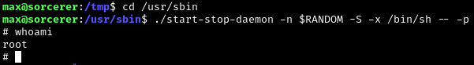

# Sorcerer
* Origin: Proving Grounds (OffSec)
* Difficulty: Intermediate
* OS: Linux

## Enumeration
Initial nmap scan shows a few interesting open ports, notebly a bunch of Microsoft services as well as web servers on port 80 and 8080...

```
nmap -A -oN nmap_sorcerer 192.168.x.x
```


The port 80 home 404s and directory fuzzing yielded nothing. Port 8080 looks a little more juicy.


Some quick research on Apache Tomcat 7.0.4 shows a potential code injection vulnerability: https://www.exploit-db.com/exploits/35011

Fuzzing reveals a /manager/html directory... plugging in a test injection (needs some tweaking) unintentionally gets us an error showing Apache Tomcat 9.0.38 is possibly what is actually running despite what is shown on the home page. Interersting.
```
http://192.168.230.100:8080/manager/html/sessions?path=/&sort=[alert("123");]
```


Will revisit this if nothing juicier shows up on the other ports. Full nmap scan for all ports keeps hanging, rustscan reveals a few more.
```
rustscan -a 192.168.230.100
```


After curl-ing a few of the ports at the end of the list we see 7742 is a web server:


## Foothold on Port 7742
Spidey senses are tickled. Directory fuzzing port 7742:
```
feroxbuster -u http://192.168.230.100:7742
```
Find a directory of zip files...


Each contains the home directory for the respective user. Max's home contains a few interesting files:


The tomcat config XML has possible credentials that don't work on the port 7742 login but may be worth revisiting somewhere on port 8080:
```
...
  <role rolename="manager-gui"/>
  <user username="tomcat" password="VTUD2XxJjf5LPmu6" roles="manager-gui"/>
...
```
SSHing in with Max's private key doesn't work either, likely because of the scp wrapper script which we happen to have a copy of.


The rules in authorized_keys shows that the tomfoolery is happening because this script is ran when we try to ssh in.


Removing the rules and SCPing the updated authorized_keys file overwrites the original one and allows us to SSH in.
```
scp -O -i id_rsa authorized_keys max@192.168.230.100:/home/max/.ssh/authorized_keys
```


Enumerating the home directory shows there is an additional user named dennis whose directory contains the local.txt flag.

## Privilege Escalation
Machine info:
```
uname -a
Linux sorcerer 4.19.0-10-amd64 #1 SMP Debian 4.19.132-1 (2020-07-24) x86_64 GNU/Linux
```
Quick manual enum of a few directories and permissions didn't yield anything. Transferred linpeas script to the target and ran, during which a SUID binary jumped out:


Wasn't immediately familiar with start-stop-daemon but quick research shows we have a potentially easy PE vector: https://gtfobins.github.io/gtfobins/start-stop-daemon/

```
./start-stop-daemon -n $RANDOM -S -x /bin/sh -- -p
```


The proof.txt flag is in /root.
